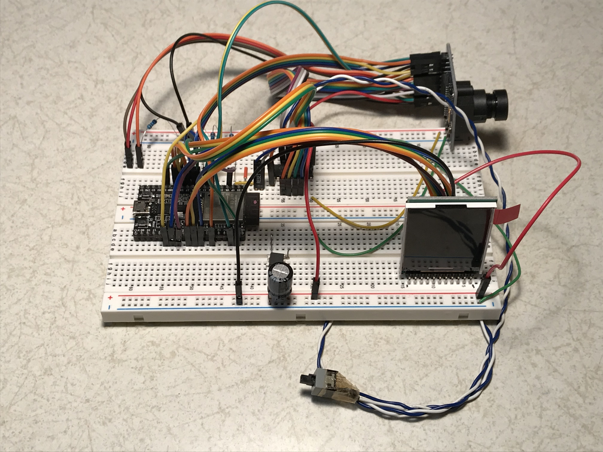

# ESP32WiFiCAM-OV7670(FIFO付き)
外観  

ESP32 WiFi Camera(OV7670版) は以下の機能を実装しています。

1. VGAサイズのBayerRAW形式画像を撮影
1. 撮影したRAW画像データをSDカードメモリに保存
1. 撮影したRAW画像データをAWS上に実装したRAW画像変換サービスにアップロード

RAW画像変換サービスはAWS Lambdaで実装されたWebサービスであり、以下の機能を実装しています。
1. アップロードされたRAW形式画像をJPEG画像に変換、S3に保存
1. AWS SNS (Simple Notification Service)を用いて画像参照URLをユーザにメール連絡

詳細は[ESPuPy/RAWImageConverter](https://github.com/ESPuPy/RAWImageConverter)を参照してください。

本カメラは下記のデバイスで構成されています。

|デバイス種別|デバイス名|
----|----
|MicroController|ESP32|
|Camera Unit|OV7670 Camera with FIFO|
|Monitor|1.8inch TFT LCD(ST7735)|
|Memory|SD Memory Card|

ESP32WiFiCAMはESP32上のMicroPythonで動作します。

本アプリを稼働させるには以下のドライバが必要です。URLを併記しますので取得して本アプリと同じディレクトリに置いてください。

1. sdcard.py https://github.com/micropython/micropython/tree/master/drivers/sdcard
1. ST7735.py https://github.com/boochow/MicroPython-ST7735
1. terminalfont.py https://github.com/GuyCarver/MicroPython/tree/master/lib

本システムの概要説明は、[Interface 2020 4月号](https://interface.cqpub.co.jp/magazine/202004/) pp.80-89にも記載しています。併せてご参照ください。
本システムは開発時期、処理速度の関係により、MicroPython(V1.10)でテストしています。最新版のV1.20では未テストです。

すべてのファイル、ソースはMITライセンスに従っています。 All files are subject to MIT license.
